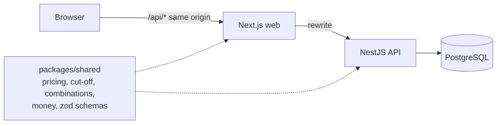
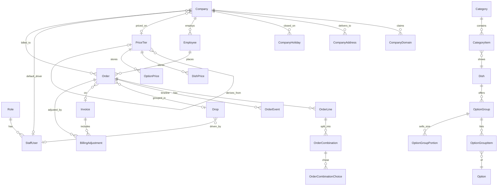

# Fernleaf Kitchen admin panel

Internal admin panel for a commercial kitchen that runs corporate meal programmes. Staff set up the catalogue, pricing, companies and employees, take orders on employees' behalf, cook, dispatch, deliver and bill each company.

**Live app**: _link added at deployment_

| Role | Email | Password |
| --- | --- | --- |
| Admin | admin@test.com | Test@1234 |
| Kitchen | kitchen@test.com | Test@1234 |
| Dispatch | dispatch@test.com | Test@1234 |
| Driver | driver@test.com | Test@1234 |

**Kitchen time zone**: America/New_York. Every date, cut-off and "today" is computed in that zone, whatever the server or browser zone is. It is a setting.

## Contents

1. [Local setup](#local-setup)
2. [Architecture](#architecture)
3. [Data model](#data-model)
4. [Key decisions and trade-offs](#key-decisions-and-trade-offs)
5. [Dashboards](#dashboards)
6. [Prioritisation](#prioritisation)
7. [Ambiguities and how I read them](#ambiguities-and-how-i-read-them)
8. [Demo data](#demo-data)

## Local setup

Needs Node 22+ and pnpm 11+. No Docker: a local Postgres runs from an npm package.

```bash
pnpm install
pnpm --filter @fernleaf/shared build

# terminal 1: Postgres 17 on port 54329, data in apps/api/.dev-db
pnpm db:dev

# terminal 2
cp apps/api/.env.example apps/api/.env
pnpm --filter api exec prisma migrate deploy
pnpm --filter api db:seed          # resets the local DB: base data + ~480 demo orders
pnpm --filter api dev              # API on :4000

# terminal 3
pnpm --filter web dev              # web on :3100, proxies /api to :4000
```

Checks, from the repo root:

```bash
pnpm lint
pnpm typecheck
pnpm test        # needs `pnpm db:dev` running; API tests use the fernleaf_test database
```

The seed refuses to reset a non-localhost database unless `SEED_ALLOW_REMOTE=true`.

## Architecture

```
apps/web         Next.js 15 (App Router). Client components, TanStack Query.
                 /api/* is rewritten to the API, so the session cookie is first-party.
apps/api         NestJS 11 + Prisma 6 on PostgreSQL. All business rules live here.
packages/shared  Pure domain functions and zod schemas, used by both apps.
```



- **Business logic is server-side**: the web never decides anything that matters. It previews prices with the same shared function, but the API recalculates and validates every order. No Next.js server actions.
- **Shared domain functions**: `packages/shared/src/domain` holds pricing resolution, cut-off counting, combination validation, planned times and money maths as pure functions. They are unit-tested without a database, and the API calls them inside transactions.
- **Shared schemas**: request bodies are zod schemas in `packages/shared`. The API validates with them (a `ZodPipe`); forms send the same shapes.
- **API modules**: auth and staff, catalog (catalogue, reference data, pricing, menu), companies (companies, employees, settings), orders (order builder, cut-off), kitchen, dispatch (including the driver view), billing, dashboards, demo.
- **One error shape**: `{ code, message, fieldErrors? }` from a single exception filter. Forms put `fieldErrors` next to the matching input, keyed by path (`lines.0.combinations.1.quantity`).

### Access control

- **Permissions, not roles**: the code checks permissions (`orders.write`, `kitchen.work`, `deliveries.own`, ...). A role is a database row holding a permission list. Adding a role means inserting a row; no code mentions a role name.
- **Fail closed**: a global guard runs on every request. A route must declare `@Requires(...)`, `@SignedIn()` or `@Public()`; a route with none is denied.
- **Fresh on every request**: the user and role are reloaded each request, so deactivating a user or editing a role takes effect immediately.
- **Scoped data**: drivers only get their own drops for today, enforced in the query and again on delivery.
- **Tested over HTTP**: `apps/api/test/access.test.ts` signs in with the four review accounts and checks a permission matrix.

## Data model



Full schema: [apps/api/prisma/schema.prisma](apps/api/prisma/schema.prisma).

- **Money**: integer cents everywhere. Multipliers are integer basis points (2.4 = 24000). No floats touch a price.
- **Dates and times**: delivery date is a `date` (a kitchen-zone calendar date), delivery time is minutes after local midnight, and instants (cut-off, planned and actual times) are UTC `timestamptz`, converted with Luxon in the kitchen zone.
- **Order snapshots**: an order line copies the dish name, SKU, station, temperature and the dish price on the tier. Each choice copies group name, option name, option price and portion extra, and the order keeps the tier name. Editing the catalogue or prices never changes a past order, while the IDs stay linked for reporting.
- **Combination = prep unit**: `OrderCombination` is both the priced combination on a line and the kitchen's unit of work (`startedAt`, `doneAt`). One table, so the kitchen cannot drift from what was ordered.
- **Order belongs to a company**: `Order.companyId` is set when the order is created. If the employee later moves company, past orders stay billed to the old one.
- **Drops are rows**: a `Drop` is unique on (date, company, address, delivery time) and holds the driver, delivery time, note and photo. Changing an order's time or address re-links it to the matching drop, creating one if needed.
- **Soft deletes**: dishes, options, addresses and reference rows are deactivated, never deleted, because orders point at them.
- **Constraints in Postgres**: partial unique indexes enforce one default tier and one default address per company. CHECK constraints keep money and quantities non-negative, and block "done" without "started".

## Key decisions and trade-offs

- **Pricing is resolved on read**: a tier is `MANUAL` (typed prices only), `COST_MULTIPLIER` (cost × m) or `TIER_MARKUP` (another tier × m). A stored row on a derived tier is a staff override. Derived prices are computed when a menu or order needs them and rounded up to the next 5 cents. No cached derived prices means nothing to go stale when a cost or base price changes. Cost: one catalogue-wide query per menu build, fine for a catalogue of hundreds of items. Loops between tiers are rejected when saved.
- **Chained tiers round at every step**: a tier derived from a derived tier uses the base tier's rounded price. That is the price staff see on the base tier, so it is the one a markup should apply to.
- **Missing prices hide things**: a dish with no price on the employee's tier is left off their menu. An option with no price is dropped from its group. A dish whose required group is left with no options is dropped, because it could not be ordered.
- **Order validation reuses the menu**: the `OrderBuilder` validates against the employee's own menu, the same function behind the menu preview. A hidden, unpriced or inactive dish cannot be ordered through the API even if the form is bypassed.
- **Cut-off is a pure function**: count back N kitchen working days (skipping kitchen non-working days and holidays), then the cut-off time in the kitchen zone. The company calendar only restricts which days can take deliveries; it never moves the cut-off. Tests cover the brief's example, weekends, holidays, 0 days, a DST change and the exact boundary.
- **Cut-off processing is idempotent by construction**: drafts→cancelled and placed→confirmed are single `UPDATE ... WHERE status = X RETURNING id` statements. A second or concurrent run finds nothing left to change, and timeline events are written only for rows that run changed. It runs every 5 minutes, once on boot (free hosts sleep and miss cron ticks), and from Settings for any date whose cut-off has passed.
- **Edits are checked against the clock, not cron**: editing and cancelling check the cut-off directly, so a late cron run never lets a staff member edit a locked order.
- **Concurrency**:
  - **Order edits**: an optimistic `version`. The second of two simultaneous saves gets "someone else changed this order".
  - **Kitchen units**: actions lock the order row (`SELECT ... FOR UPDATE`), then update conditionally (`WHERE "doneAt" IS NULL`). Two people pressing done: one wins, one gets "already done". Two units finishing at once still mark the order ready exactly once.
  - **Drops**: the drop row is locked for driver changes and stage moves.
  - **Invoices**: orders are claimed with `UPDATE ... WHERE "invoiceId" IS NULL`. If any order was taken meanwhile, the whole invoice rolls back.
- **Post-invoice changes**: an issued invoice never changes (only "paid"). Cancelling an invoiced order automatically adds a credit `BillingAdjustment` for the billed amount. Admins can add adjustments by hand (for example a short delivery); a credit cannot exceed what was billed. Adjustments go on the company's next invoice. Admin changes to time, address or packaging do not change money, so they need no adjustment.
- **What counts as billable**: confirmed and delivered orders. The invoice total is the sum of its orders' billed amounts plus its adjustments. The invoice page shows whether that holds.
- **Planned times are stored**: dispatch-ready = delivery − the company's lead minutes; kitchen-ready = dispatch-ready − 30 minutes (a setting). They are stored on the order and recalculated when an admin changes the delivery time. Late = past the planned time and not done; at risk = due within 30 minutes (a setting).
- **On time**: delivered no later than the slot plus a grace period (10 minutes, a setting), recorded on the drop and on each order.
- **Session cookie through a proxy**: Next.js rewrites `/api/*` to the API. The browser sees one origin, so the httpOnly `SameSite=Lax` cookie works without CORS or third-party cookie problems.
- **Photos in Postgres**: the driver's photo is shrunk to at most 1280 px JPEG in the browser and stored as `bytea`. No extra storage service to provision. Trade-off: not suited to large volumes; object storage would be next.
- **Tests**: 40 pure unit tests (money, pricing, cut-off, combinations) and 20 integration tests against a real Postgres. The integration tests cover order pricing and snapshots, server validation, cut-off locking and idempotency under concurrency, optimistic locking, kitchen and dispatch rules under concurrency, invoicing races, credits, the HTTP permission matrix, and a 400-order kitchen board (9 ms locally). No UI tests, as the brief allows.

## Dashboards

Shared rules for every figure:

- **Dates**: delivery dates in the kitchen time zone.
- **Billable**: confirmed or delivered. Cancelled and rejected orders never count as revenue.
- **Money**: the order's stored total, at the prices when it was ordered.

### Admin: Overview

For the owner or ops lead deciding where to look today: money at risk, delivery quality, upcoming load, and gaps that hide dishes.

| Figure | Definition |
| --- | --- |
| Today's orders | Count of confirmed + delivered orders with delivery date = today. Sub-line: their total. |
| On time, last 14 days | Delivered orders with delivery date in the 14 days before today with `onTime = true`, divided by delivered orders in that window with `onTime` known. Orders with unknown on-time status are excluded from both. |
| Cancelled after placing, 14 days | Orders with delivery date in the 14 days before today that were ever placed (`placedAt` set) and are now cancelled or rejected, divided by all ever-placed orders in that window. Drafts cancelled at cut-off are excluded: they were never commitments. |
| Not yet invoiced | Sum and count of billable orders with no invoice, any date (including today and confirmed future dates). Oldest = earliest such delivery date. |
| Invoiced, unpaid | Sum and count of invoices with status Issued. |
| Next 8 days | Per delivery date, today to today + 7: count of drafts, placed, confirmed (incl. delivered), cancelled (incl. rejected), and the cut-off instant. Booked = total of placed + confirmed + delivered. Drafts before cut-off are highlighted because cut-off will cancel them. |
| Revenue by company | Billable orders with delivery date in the 30 days before today, grouped by `Order.companyId` (the company at order time). Share = company total ÷ sum of all companies. |
| Deliveries, last 14 days | Per delivery date: delivered orders on time and late. Days with no deliveries are omitted. |
| Menu gaps | For each tier that is the default or used by a company: active dishes with no effective price on it (they are hidden from those menus). |

**Not shown**:

- **Margin**: costs are typed by hand and options make per-order cost estimates unreliable. The pricing grid shows margin per item instead.
- **Charts**: tables give exact numbers.
- **Per-employee figures**: not a decision this person makes.

### Kitchen: Kitchen today

For the kitchen lead at 6 am: how much to cook, where it is behind, what to cook next, and what is coming tomorrow.

| Figure | Definition |
| --- | --- |
| Portions left to cook | Sum of quantity over prep units of today's confirmed + delivered orders with `doneAt` empty. "Of N" = all such units' quantity. |
| Late units | Not-done units whose order's planned kitchen-ready time has passed. |
| At risk | Not-done units due within the at-risk window (30 min). |
| Orders ready | Orders with every unit done ÷ orders with any unit today. |
| Next due | Earliest planned kitchen-ready among orders with a unit not done. |
| By station | The same counts per station; dishes with no station are under Unassigned. |
| Cook next, batched | Units with the same station, dish and combination label summed across orders, with the earliest due time. Only batches with something left. |
| Prep ahead, tomorrow | Confirmed portions per station for tomorrow. Placed orders are excluded because they can still change until cut-off. |

**Not shown**:

- **Revenue**: not the kitchen's job.
- **Placed or draft orders for today**: they cannot exist after cut-off.
- **Per-cook speed**: no data model for who cooks what beyond start/done, and it invites the wrong incentives.

### Dispatch: Dispatch today

For the dispatcher: which drops are stuck, which have no driver, and how loaded each driver is.

| Figure | Definition |
| --- | --- |
| Drops today | Drops for today with at least one confirmed or delivered order. |
| Stage counts | A drop's stage is its least advanced order: still in kitchen (not started or cooking), ready to pack (kitchen ready), waiting for driver (dispatch ready), out, delivered. |
| Delivered on time | Delivered drops today with `onTime = true` ÷ delivered drops today. |
| No driver | Not-delivered drops with no driver. |
| Needs attention | Late or at-risk drops. Before leaving: against planned dispatch-ready (earliest in the drop). Once out: against the delivery slot. |
| Drivers | Per driver: drops, meals (sum of line quantities), drops not yet delivered. |

**Not shown**:

- **Routes and maps**: no address geocoding in scope.
- **Historical driver performance**: one day's view is what a dispatcher acts on.

### Driver: My deliveries

Today's own drops in time order, count to go and delivered, address with a maps link, standing instructions, each order's name, packaging and items, and a large "Mark delivered" button with optional note and photo. Not shown: prices, other drivers' drops, other days.

## Prioritisation

### Built

- **Every [Must] in section 4**: catalogue, menu, pricing, companies, employees, orders, kitchen board, dispatch and driver view, billing, settings, dashboards. Each rule is enforced in the API, with the error shape described above.
- **[Should] portions**: groups sell sizes with an extra charge, and the server checks that every option supports every size of its group, both when saving a group and when changing an option's sizes.
- **[Should] CSV import**: per-row validation and save; bad rows are reported with their row number, and the rest are imported.
- **Section 7**: money in cents, kitchen-zone time, concurrency, server pagination, tests for the business rules, clean lint and type-check.

### Skipped, and why

- **Role editor UI**: roles are rows and can be added without code changes, but there is no screen to create one or edit its permission list. Settings shows each role's permissions and lets admins assign roles. I put the time into enforcing the rules instead.
- **Image upload for dishes**: dishes take an image URL. Upload needs object storage; the driver photo shows the upload path works.
- **Bulk "price from cost" actions**: derived tiers already cover "cost × 2.4". A one-off "fill missing prices from cost" button would be quicker for gaps on manual tiers, but is not needed for correctness.
- **Out of scope per section 5**: payments, exports, audit logs (the order timeline covers order history only), notifications, tax, fees, customer app.
- **Emails are log lines**: where an email would go out (order confirmed or draft cancelled at cut-off, invoice issued, order delivered), the API logs `[Email] would email <to>: <subject>` after the change commits.

### Next, with more time

- **Role and permission editor**, and an audit trail for admin overrides.
- **Kitchen board virtualisation** for days well past 400 orders. It renders fine at 400, but every unit is a DOM row.
- **Live updates** (SSE) on the kitchen and dispatch boards instead of 15-second polling.
- **Price history**: a view of who changed which price when. Orders already keep their own prices.
- **Playwright end-to-end tests** for the order form and driver flow.

## Ambiguities and how I read them

- **"Kitchen working days" vs delivery days**: the cut-off counts back over the kitchen calendar only. A delivery date must be a company working day and not a company holiday, and also a kitchen working day: the kitchen cooks on the delivery day.
- **The cut-off day itself**: N working days before the delivery date never counts the delivery date. With 0 days, the cut-off is on the delivery day at the cut-off time.
- **"Before the cut-off ... edited and cancelled. After ... except by an admin"**: admins can still edit draft and placed orders after cut-off (before processing confirms them). Once confirmed, lines are fixed; admins can only change time, address or packaging, cancel, or force-complete in the kitchen. Changing what was ordered after confirmation is a credit adjustment, not an edit.
- **Rejected**: an admin can reject a placed order (the kitchen refuses it), distinct from a cancellation. Both carry an optional reason in the timeline.
- **Option prices on a tier**: options are priced per tier like dishes. An option with no price on the employee's tier is not offered to them. Portion extras are a flat amount per group and size, not tiered: the brief puts the extra on the group.
- **Hiding an "item" from a company**: hiding works per dish, across every category it appears in. It is simpler for staff ("Bluebird doesn't get Gulab Jamun"), and a dish in two categories is still one dish.
- **Secret categories**: not listed in the menu, reachable by slug in the preview. Dishes in a secret category are orderable, since being reachable is the point.
- **Owner**: must be an employee of the company, so it is set after employees exist. An owner cannot be moved to another company until a new owner is picked.
- **Employee emails**: must be on one of the company's domains. That is what the domains are for, and it stops an employee being attached to the wrong company.
- **Delivery address, time and packaging flags**: without the flag, the order uses the company default. Admins (`orders.override`) can set them anyway.
- **"Each step requires the previous one and can't be repeated"**: stages apply per drop, and every order in it must be at the previous stage. If an order joins a drop that has already moved on (an admin changed its time), the drop shows the least advanced stage, and the step can be applied to the remaining orders.
- **Who can record a delivery**: the drop's driver, for today only. Dispatch can also record it on the driver's behalf (phone dead, handed over at the door).
- **Minimum order quantity**: applies to the line total for that dish on one order.
- **Duplicate combinations**: two identical combinations on one line are rejected ("merge the quantities"), so one combination is exactly one prep unit.

## Demo data

The brief says "today will be whichever day we review", and the app must already have realistic data then. A one-off seed would be stale within a day, so the API keeps the demo current:

- **Base seed** (`pnpm --filter api db:seed`): 4 roles, the 4 review accounts plus a second driver and cook, reference lists, 24 dishes (one inactive, one without a Standard price), 20 options, 7 categories including a secret one, 3 tiers (Standard typed in; Enterprise = Standard − 8%; Partner = cost × 2.6), 5 companies with 50 employees, kitchen settings and holidays.
- **Demo orders**: `DemoService` runs on boot and hourly when `DEMO_DATA=true`. It creates orders through the real `OrdersService`, so prices and rules are real. It marks them `createdById = 'demo'` and never touches any other order:
  - **Fill**: every date from 14 days ago to 7 days ahead with no orders gets orders for the companies that take deliveries that day.
  - **Past days**: mostly delivered, some cancelled or rejected, invoiced weekly once older than 7 days; the oldest invoices are paid.
  - **Future days**: placed, or still drafts.
  - **Close out**: demo orders left confirmed on a past date are marked delivered.
  - **Shape today**, once per day: today's drops go to driver@test.com (one to the second driver). The earliest drop is fully cooked and out for delivery, so the driver account can deliver straight away. Some orders are part-cooked, the rest untouched, so kitchen and dispatch have real work.
- **Kitchen open 7 days in the seed**: so there is something to review on a weekend. Weekends are lighter because only Kestrel Robotics (Mon-Sat) and Copperleaf Studios (Wed-Sun) take weekend deliveries.

Orders created by reviewers are never touched by the demo service.
