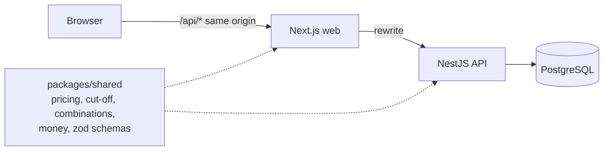
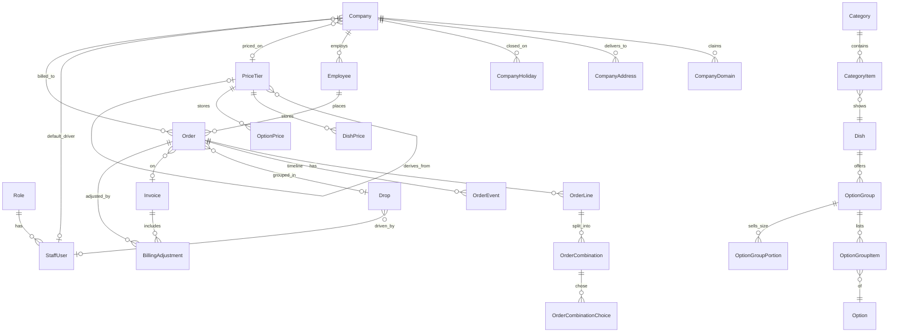

# Fernleaf Kitchen admin panel

Internal admin panel for a commercial kitchen that runs corporate meal programmes. Staff manage the catalogue, pricing, companies and employees, place orders, cook, dispatch, deliver and invoice.

**Live app**: https://heizen-task.vercel.app/

**Deployed on**: Vercel (Next.js frontend) · Render (NestJS API) · Neon (Postgres, serverless)

| Role     | Email                | Password  |
|----------|----------------------|-----------|
| Admin    | admin@test.com       | Test@1234 |
| Kitchen  | kitchen@test.com     | Test@1234 |
| Dispatch | dispatch@test.com    | Test@1234 |
| Driver   | driver@test.com      | Test@1234 |

**Kitchen time zone**: America/New_York. All dates, cut-offs and "today" are computed in that zone regardless of where the server or browser is. It's a configurable setting.

## Contents

1. [Local setup](#local-setup)
2. [Architecture](#architecture)
3. [Data model](#data-model)
4. [Key decisions and trade-offs](#key-decisions-and-trade-offs)
5. [Dashboards](#dashboards)
6. [Prioritisation](#prioritisation)
7. [Ambiguities and how I read them](#ambiguities-and-how-i-read-them)
8. [Demo data](#demo-data)

## Local setup

Needs Node 22+ and pnpm 11+. No Docker; Postgres runs via an npm package.

```bash
pnpm install
pnpm --filter @fernleaf/shared build

# terminal 1: Postgres on port 54329
pnpm db:dev

# terminal 2: API on :4000
cp apps/api/.env.example apps/api/.env
pnpm --filter api exec prisma migrate deploy
pnpm --filter api db:seed
pnpm --filter api dev

# terminal 3: web on :3100
pnpm --filter web dev
```

Checks, from the repo root:

```bash
pnpm lint
pnpm typecheck
pnpm test
```

## Architecture

```
apps/web         Next.js 15 (App Router). Client components, TanStack Query.
                 /api/* is rewritten to the API, so the session cookie is first-party.
apps/api         NestJS 11 + Prisma 6 on PostgreSQL. All business rules live here.
packages/shared  Pure domain functions and zod schemas used by both apps.
```



- **Business logic is server-side**: the web previews prices using the shared function, but the API recalculates and validates every order. No Next.js server actions.
- **Shared domain functions**: `packages/shared/src/domain` has pricing, cut-off, combination validation and money maths as pure functions. Unit-tested without a database; the API calls them inside transactions.
- **Shared schemas**: request bodies are zod schemas in `packages/shared`. The API validates with them via a `ZodPipe`; forms send the same shapes.
- **One error shape**: `{ code, message, fieldErrors? }` from a single exception filter. Forms put `fieldErrors` next to the right input, keyed by path like `lines.0.combinations.1.quantity`.

### Access control

- **Permissions, not roles**: the code checks permission strings (`orders.write`, `kitchen.work`, `deliveries.own`). A role is just a database row with a permission list; adding a new role is an INSERT, not a code change.
- **Fail closed**: every route must declare `@Requires(...)`, `@SignedIn()` or `@Public()`. Anything else is denied.
- **Fresh on every request**: user and role are reloaded per request, so deactivating someone or editing a role takes effect immediately.
- **Tested over HTTP**: `apps/api/test/access.test.ts` signs in with all four review accounts and checks the full permission matrix.

## Data model



Full schema: [apps/api/prisma/schema.prisma](apps/api/prisma/schema.prisma).

A few things worth calling out explicitly:

- **Money**: integer cents throughout. Multipliers are integer basis points (2.4 = 24000). No floats near prices.
- **Dates and times**: delivery date is a `date` column (kitchen-zone calendar date), delivery time is minutes after local midnight, and instants are UTC `timestamptz` converted with Luxon in the kitchen zone.
- **Order snapshots**: each line copies the dish name, SKU, station and price at order time. Catalogue changes never affect past orders, but IDs stay linked for reporting.
- **Combination = prep unit**: `OrderCombination` is both the priced combination and the kitchen's unit of work. One table means the kitchen can't drift from what was ordered.
- **Soft deletes**: dishes, options, addresses and reference rows are deactivated, not deleted, since orders reference them.

## Key decisions and trade-offs

- **Pricing is resolved on read**: a tier is `MANUAL`, `COST_MULTIPLIER` (cost x m) or `TIER_MARKUP` (another tier x m). A stored price on a derived tier acts as a staff override. Derived prices compute fresh each time and round up to the next 5 cents; nothing cached, so a base price change takes effect immediately. Loops between tiers are rejected at save time.
- **Missing prices hide things**: a dish with no price on the employee's tier is dropped from their menu. A required group with no priced options takes the dish with it.
- **Order validation reuses the menu**: `OrderBuilder` validates against the employee's own live menu. You can't order a hidden or unpriced dish through the API even if you bypass the form.
- **Cut-off is a pure function**: count back N kitchen working days, then apply the cut-off time in the kitchen zone. The company calendar only controls which days accept deliveries; it never moves the cut-off. Tests cover the brief's example, weekends, holidays, 0-day cut-offs, a DST change and the exact boundary second.
- **Cut-off processing is idempotent**: drafts to cancelled and placed to confirmed are single `UPDATE ... WHERE status = X RETURNING id` statements. A concurrent run finds nothing left to change. Runs every 5 minutes, once on boot, and from Settings for any past cut-off date.
- **Concurrency**:
  - **Order edits**: optimistic `version` field. The second simultaneous save gets "someone else changed this order".
  - **Kitchen units**: `SELECT ... FOR UPDATE` then `WHERE "doneAt" IS NULL`. Two people pressing done simultaneously; one wins, one gets "already done".
  - **Invoices**: orders claimed with `UPDATE ... WHERE "invoiceId" IS NULL`. If anything was taken concurrently, the whole invoice rolls back.
- **Post-invoice changes**: cancelling an invoiced order creates a credit `BillingAdjustment` automatically. Admins can add manual adjustments; credits can't exceed what was billed.
- **Photos in Postgres**: driver photos are resized to max 1280px JPEG client-side and stored as `bytea`. No extra storage service needed. Wouldn't scale to high volume, but object storage would be the obvious next step.
- **Tests**: 40 pure unit tests (money, pricing, cut-off, combinations) and 20 integration tests against real Postgres. Coverage includes pricing, snapshots, cut-off locking and idempotency, optimistic locking, concurrent kitchen and dispatch, invoicing races, credits, HTTP permission matrix, and a 400-order kitchen board (9 ms locally). No UI tests, as the brief allows.

## Dashboards

All figures use delivery dates in the kitchen time zone. "Billable" means confirmed or delivered; cancelled and rejected orders never count as revenue.

**Admin overview**: built for the owner or ops lead. Shows money at risk (unconfirmed orders, unpaid invoices), a pipeline of the next 8 delivery dates with draft/placed/confirmed counts and cut-off times, on-time rate and cancellation rate over the last 14 days, revenue by company over 30 days, and a menu gaps table listing dishes that are invisible on a tier any company uses.

**Kitchen today**: built for the kitchen lead at 6 am. Portions left to cook, late and at-risk units, orders ready, and next due time. A station breakdown and a "cook next" batched view groups the same dish and combination across orders so the team can cook in bulk. Tomorrow's confirmed load is shown so prep can start early.

**Dispatch today**: drops grouped by stage (in kitchen, ready to pack, waiting for driver, out, delivered), a "needs attention" list of late or at-risk drops, drops with no driver, and a per-driver load summary.

**Driver: My deliveries**: today's own drops in time order with a maps link, standing instructions, items per order, and a "Mark delivered" button with optional note and photo. Prices and other drivers' drops aren't shown.

## Prioritisation

### Built

- **Every [Must] in section 4**: catalogue, menu, pricing, companies, employees, orders, kitchen board, dispatch and driver view, billing, settings, dashboards. Every rule is enforced server-side.
- **[Should] portions**: groups sell sizes with an extra charge. The server checks every option supports every size of its group.
- **[Should] CSV import**: per-row validation; bad rows are reported with their row number and the rest are imported.
- **Section 7**: money in cents, kitchen-zone time, concurrency handling, server pagination, tests for business rules, clean lint and typecheck.

### Skipped, and why

- **Role editor UI**: roles are database rows and fully functional; there's just no screen to create or edit them. Settings shows each role's permissions and lets admins assign roles. I prioritised enforcing the rules over building the editor.
- **Image upload for dishes**: dishes take an image URL. The driver photo upload shows the plumbing works; adding object storage felt out of scope.
- **Out of scope per section 5**: payments, exports, full audit logs, notifications, tax, fees, customer app.
- **Emails are log lines**: where an email would fire (confirmed, cut-off cancellation, invoice issued, delivery), the API logs `[Email] would email <to>: <subject>` after the change commits.

### Next, with more time

- Role and permission editor with an audit trail for admin overrides.
- Kitchen board virtualisation; it renders fine at 400 orders but every unit is a DOM row.
- Live updates via SSE on kitchen and dispatch boards instead of 15-second polling.
- Playwright end-to-end tests for the order form and driver flow.

## Ambiguities and how I read them

- **"Kitchen working days" vs delivery days**: cut-off counts back over the kitchen calendar only. A delivery date must be both a kitchen working day and a company working day.
- **The cut-off day itself**: N working days before delivery never counts the delivery date. With 0 days, the cut-off falls on the delivery day at the cut-off time.
- **Editing after cut-off**: admins can edit draft and placed orders after cut-off until processing confirms them. Once confirmed, lines are locked; admins can only change time, address or packaging, cancel, or force-complete. Changing what was ordered post-confirmation is a credit adjustment, not an edit.
- **Rejected**: an admin can reject a placed order (kitchen refuses it), distinct from cancellation. Both carry an optional reason in the timeline.
- **Option prices on a tier**: options are tiered like dishes. An option with no price on the employee's tier isn't offered to them. Portion extras are flat per group and size, not tiered.
- **Hiding an "item" from a company**: hiding is per dish across every category it appears in. A dish in two categories is still one dish; simpler for staff.
- **Secret categories**: not listed in the menu but reachable by slug in the preview. Dishes there are orderable since being reachable is the point.
- **Owner**: must be a current employee of the company. Can't move company until a replacement is picked.
- **Employee emails**: must match one of the company's domains, to prevent attaching employees to the wrong company.
- **"Each step requires the previous one and can't be repeated"**: stages apply per drop, every order must be at the previous stage. If an order joins a drop that's already moved on, the drop shows the least advanced stage and the step can apply to remaining orders.
- **Who can record a delivery**: the drop's assigned driver, for today only. Dispatch can record it on the driver's behalf too.
- **Duplicate combinations**: two identical combinations on one line are rejected ("merge the quantities"), so one combination = one prep unit.

## Demo data

The brief says "today will be whichever day we review", so a one-off seed would go stale. The API keeps demo data current automatically:

- **Base seed** (`pnpm --filter api db:seed`): 4 roles, the 4 review accounts plus a second driver and cook, 24 dishes, 20 options, 7 categories (including a secret one), 3 tiers (Standard typed in; Enterprise = Standard - 8%; Partner = cost x 2.6), 5 companies with 50 employees, kitchen settings and holidays.
- **Demo orders** (`DEMO_DATA=true`): `DemoService` runs on boot and hourly. Creates orders through the real `OrdersService` so prices and rules are real. Tags them `createdById = 'demo'` and never touches reviewer-created orders:
  - **Fill**: any missing date in a 21-day window gets orders for companies that take deliveries that day.
  - **Past days**: mostly delivered, some cancelled or rejected, invoiced weekly once older than 7 days.
  - **Future days**: placed, or still drafts.
  - **Shape today** (once per day): the earliest drop is fully cooked and out for delivery so the driver can deliver immediately. Some orders are part-cooked, the rest untouched, so kitchen and dispatch have real work to do.
- **Kitchen open 7 days**: so there's always something to review on a weekend. Weekends are lighter because only Kestrel Robotics (Mon-Sat) and Copperleaf Studios (Wed-Sun) take weekend deliveries.
